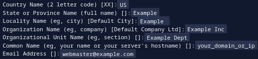

# PRUEBA TÉCNICA CASA MECATE

## FRONT - REACT

Proyecto creado para la prueba técnica de Casa Mecate. Fue un reto, me divertí aprendiendo a utilizar react y agradezco
por la oportunidad de salir de mi zona de confort y aprender algo nuevo.

This project was bootstrapped with [Create React App](https://github.com/facebook/create-react-app).

## Ejecutar proyecto

Para poder visualizar el proyecto tenemos dos formas, la primera y más sencilla es la ejecución que ofrece el mismo npm
y react, y la segunda forma ya es mediante un servidor, en este caso, un servidor apache2.

Es necesario ejecutar el comando `npm install` al clonar el proyecto para tener todas las dependencias

### Sin servidor

Para ejecutar el proyecto mediante npm sin tener un servidor, hay que ejecutar el siguiente commando ```npm start```
dentro del directorio raíz del proyecto

### Con Servidor [Apache](https://httpd.apache.org/)

Para configurar el servidor solo es necesario tener instalado el servidor e iniciar sus servicios.
Recomiendo revisar el
siguiente [tutorial](https://www.digitalocean.com/community/tutorials/how-to-install-the-apache-web-server-on-ubuntu-20-04-es)
que explica de manera sencilla como montar un servidor en [ubuntu](https://ubuntu.com/)

Crea el certificado de autofirmado

* Habilita el mod SSL
    * `sudo a2enmod ssl`
* Reinicia apache
    * `sudo systemctl restart apache2`
* Crea el certificado de autofirmado
    *
    ```sudo openssl req -x509 -nodes -days 365 -newkey rsa:2048 -keyout /etc/ssl/private/apache-selfsigned.key -out /etc/ssl/certs/apache-selfsigned.crt```
* Completa la información solicitada
  * 
* Listo

Una vez teniendo el servidor listo vamos a hacer lo siguiente
* Ubicar el directorio de trabajo `/var/www/`
* Clonar este proyecto dentro del directorio
* Si no tiene la carpeta Build generarla con `npm run build`
  * Esta carpeta es a la que va a apuntar nuestro vhost
* Crear el archivo .htaccess con lo siguiente
  * FallbackResource ./index.html 
  * Esto va a indicar la página principal a apuntar
* Crea el vhost dentro de `/etc/apache2/sites-available/[nombre].conf`
  * nombre: el nombre que quieras ponerle a tu vhost
* Plantilla de vhost con autofirmado
```apacheconf
<VirtualHost *:80>
          ServerName [url.domain]
          Redirect / https://[url.domain]/
</VirtualHost>


<VirtualHost *:443 >
        ServerName [url.domain]
        DocumentRoot /var/www/[dir_name]/build

        ErrorLog /var/www/[dir_name]/src/logs/error.log
        CustomLog /var/www/[dir_name]/src/logs/access.log combined

        SSLEngine on
        SSLCertificateFile /etc/ssl/certs/apache-selfsigned.crt
        SSLCertificateKeyFile /etc/ssl/private/apache-selfsigned.key
</VirtualHost>
```
  * Copia esta plantilla dentro de tu archivo conf
    * url.domain: Es la url donde quieras montar el proyecto
      * Agrega esta misma dentro dee tu archivo `/etc/hosts`
        * `sudo nano /etc/hosts`
        * Agrega la línea
          * 127.0.0.1       "[url.domain]"
    * dir_name: Nombre del directorio del proyecto clonado
* Reinicia apache y tendrás listo tu proyecto